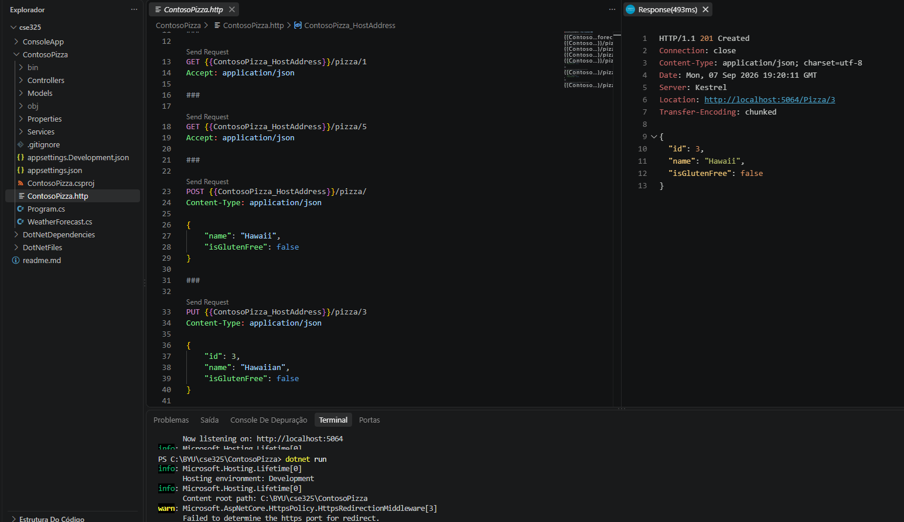

# Module Evidence and Part 2 Function

## 1. Evidence from `Create a web API with ASP.NET Core controllers`

The `ContosoPizza` Web API registers controller support in `Program.cs` and maps
controller routes with `app.MapControllers()`.

The existing pizza content in `ContosoPizza/Services/PizzaService.cs` is:

```json
[
  {
    "id": 1,
    "name": "Classic Italian",
    "isGlutenFree": false
  },
  {
    "id": 2,
    "name": "Veggie",
    "isGlutenFree": true
  }
]
```

The additional record for the POST request is:

```json
{
  "id": 4,
  "name": "Cheese",
  "isGlutenFree": false
}
```

The API assigns the next available identifier when this record is posted. The
controller returns `201 Created` and a link to the corresponding GET action.

### 1.1 Proof of Test

API response for the POST verb


API response for the PUT verb


API response for the GET verb


API response for the DELETE verb


Additional GET response for the created pizza


## 2. Working sales summary function for Part 2

The following is the working `CalculateSalesTotal` function from
`DotNetFiles/mslearn-dotnet-files/Program.cs`:

```csharp
void GenerateSalesReport(string reportFile, string totalsFile, string storesDirectory, IEnumerable<string> salesFiles)
{
    var report = new StringBuilder();
    var actualSalesTotal = double.Parse(File.ReadAllText(totalsFile).Trim(), CultureInfo.InvariantCulture);

    report.AppendLine("Sales Summary");
    report.AppendLine("------------------------");
    report.AppendLine();
    report.AppendLine($"  Total Sales: ${actualSalesTotal.ToString("N2", CultureInfo.InvariantCulture)}");
    report.AppendLine();
    report.AppendLine("Details:");

    var fileDetails = new List<(string FilePath, double Total)>();
    var maxTotalWidth = 0;

    foreach (var file in salesFiles)
    {
        var salesJson = File.ReadAllText(file);
        SalesData? data = JsonConvert.DeserializeObject<SalesData?>(salesJson);
        var fileSalesTotal = data?.Total ?? data?.OverallTotal ?? 0;
        var relativeFilePath = Path.GetRelativePath(storesDirectory, file);
        var formattedTotal = $"${fileSalesTotal.ToString("N2", CultureInfo.InvariantCulture)}";
        maxTotalWidth = 35 - (relativeFilePath.Length + formattedTotal.Length);
        // The next two lines aren't very professional, but work well for a school project
        var spaces = new string(' ', maxTotalWidth);
        fileDetails.Add((relativeFilePath + ":" + spaces, fileSalesTotal));
    }

    foreach (var detail in fileDetails)
    {
        var formattedTotal = $"${detail.Total.ToString("N2", CultureInfo.InvariantCulture)}";
        report.AppendLine($"  {detail.FilePath} {formattedTotal}");
    }

    File.WriteAllText(reportFile, report.ToString());
}
```

### 2.1 Proof of Test

Sales summary report

